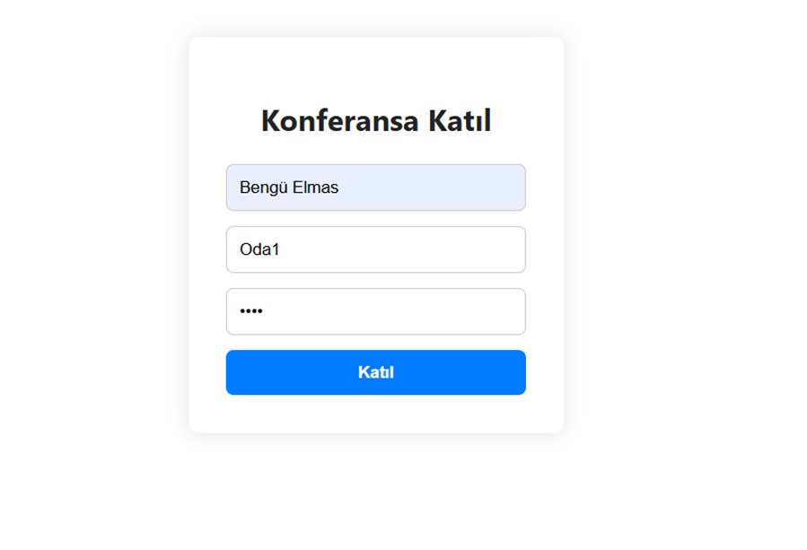
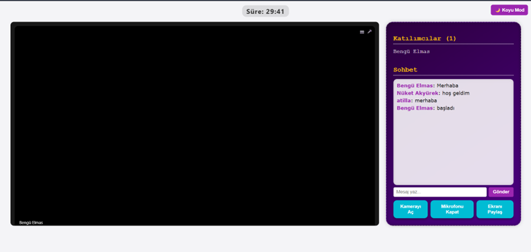

# 📞 Toplantı Uygulaması

Bu proje, **WebRTC**, **Socket.IO** ve **Node.js** kullanılarak geliştirilmiş basit bir video konferans uygulamasıdır. Kullanıcılar gerçek zamanlı olarak sesli/görüntülü görüşme yapabilir, mesajlaşabilir ve odalara katılabilir.

## 🚀 Özellikler

- ✅ Gerçek zamanlı video/ses iletimi (WebRTC)
- ✅ Kullanıcı girişleri ve odalara katılım
- ✅ Katılımcı listesi ve sayısı
- ✅ Anlık mesajlaşma (chat)
- ✅ Ngrok ile herkese açık bağlantı oluşturma

---

## ⚙️ Kurulum ve Çalıştırma

### 1. Depoyu Klonla

```bash
git clone https://github.com/benguelmas/meeting-uygulamasi.git
cd meeting-uygulamasi

2. Bağımlılıkları Kur

npm install

3. Sunucuyu Başlat

node server.js

Artık uygulaman http://localhost:3000 adresinde çalışıyor olacak.

🌐 Uygulamayı Başkalarına Açmak (Ngrok Kullanımı)
Ngrok, localhost’taki uygulamayı geçici olarak internet üzerinden erişilebilir hale getirir.

##🔧 Ngrok Kurulumu
https://ngrok.com/download adresinden uygun sürümü indir.

.zip dosyasını çıkar, ngrok.exe dosyasını klasörüne koy.

Terminalden şu komutu çalıştırarak token’ı ekle (bir defalık):

ngrok config add-authtoken <ngrok_auth_token>

Tokenı https://dashboard.ngrok.com/get-started/setup adresinden alabilirsin.

##🌍 Yayına Aç
Uygulama çalışıyorken yeni bir terminal aç ve şu komutu gir:

ngrok http 3000

Ngrok sana bir HTTPS link verecek. Bu linki toplantıya katılmasını istediğin kişilerle paylaşabilirsin.

##📁 Dosya Yapısı

meeting-uygulamasi/
├── public/
│   ├── index.html
│   ├── script.js
│   └── style.css
├── server.js
├── package.json
└── README.md

## 📸 Ekran Görüntüleri

Aşağıda uygulamaya ait bazı ekran görüntüleri yer almaktadır:





##📝 Notlar
Ngrok linkleri geçicidir. Her başlatmada yeni link oluşur.

Projeyi başkalarıyla paylaşmak için node server.js komutunu çalıştırmayı ve ngrok http 3000 komutu ile erişim linki almayı unutma.

Güvenlik ve kimlik doğrulama gibi gelişmiş özellikler bu temel sürümde yer almamaktadır.

##👩‍💻 Geliştirici
Bengü Elmas
GitHub: @benguelmas


